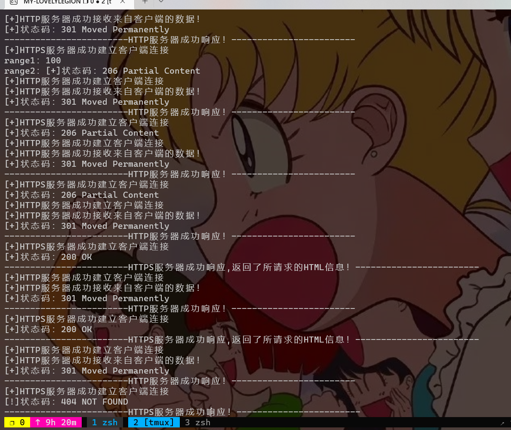

# HTTP-Server

## 项目简介

使用C++语言实现最简单的HTTP服务器，支持HTTP和HTTPS;支持GET方法，解析请求报文，返回相应应答及内容;能完成HTTP服务器分发视频。

## 项目说明

1. HTTP服务器支持HTTP和HTTPS
HTTP服务器同时支持HTTP（80端口）和HTTPS（443端口），使用两个线程分别监听各自端口。
2. HTTP服务器支持GET方法
HTTP服务器支持GET方法，解析请求报文，返回相应应答及内容，要求支持的状态码及对应场景信息如下表。   

|状态码|	状态码英文名称	|场景|
| :------: |:------: |:------: |
|200 	|OK 	|对于443端口接收的请求，如果程序所在文件夹存在所请求的文件，返回该状态码和该文件|
|301 	 |Moved Permanently |	对于80端口接收的请求，返回该状态码，在应答中使用Location字段表达相应的https URL|
|206 	 |Partial Content |	对于443端口接收的请求，如果所请求的为部分内容（请求中有Range字段），返回该状态码，以及相应的部分内容|
|404 	|Not Found 	|对于443端口接收的请求，如果程序所在文件夹没有所请求的文件，返回该状态码

3. HTTP服务器分发视频
在主机h1上运行http-server，所在目录下有一个小视频（30秒左右）。在主机h2上运行vlc（普通用户），通过网络获取并播放该小视频。抓包分析HTTP服务器和VLC客户端之间如何传输视频文件。

## 代码实现逻辑

1. 线程的建立  
①	调用pthread_t分别定义两个线程th1和th2  
②	再利用pthread_create创建不同的线程，调用编写的http_server（处理80端口的请求）和https_server（处理443端口的请求）函数  
2. HTTP服务器实现  
①	利用socket函数创建服务器套接字，指定IP协议及数据传输格式  
②	设置服务器IP地址和端口号80，并将其利用bind函数与套接字绑定  
③	使用listen函数监听该服务器套接字  
④	设置while循环，保证服务器可持续调用accept函数接收来自客户端的连接请求，并在while循环内利用recv函数读取请求详细信息，对其进行拆分处理，划分request报文字段，取出请求的uri  
⑤	编写response报文字段：返回301报头以及Location字段，便于客户端重定向到对应HTTPS地址  
⑥	关闭连接，继续等待下一次连接  
3. HTTPS服务器实现  
①	初始化SSL相关的库  
②	调用SSL_CTX_set_verify函数验证客户端证书，设置其验证模式为SSL_VERIFY_FAIL_IF_NO_PEER_CERT，若没有证书则连接直接失败  
③	采用SSL_CTX_use_certificate_chain_file函数加载自己本地的证书文件，SSL_CTX_set_default_passwd_cb_userdata函数用于加载私钥  
④	创建服务器套接字，设置相应的协议、IP地址、端口443并绑定  
⑤	使用listen函数开始监听该服务器套接字  
⑥	设置无限循环，持续等待接收客户端连接  
⑦	当接收到连接请求后，调用SSL_set_fd方法连接socket和ssl  
⑧	利用SSL_read解析请求报文，划分请求的uri等字段，并根据该uri调用access方法判断该请求的文件是否存在，若存在则进入下一步，不存在则返回404报文  
⑨	若存在该文件且存在Range字段，则返回206报文，并调用open函数读取相应的文件，根据Range的前后范围划分，循环读取文件内容，由SSL_write函数发送给客户端  
⑩	若不存在Range字段则直接循环读取文件内容，采用SSL_write函数将缓冲区内读取的文件片段依次返回给客户端  
⑪	最后释放ssl并关闭套接字，等待下一次连接请求

## 实现截图

